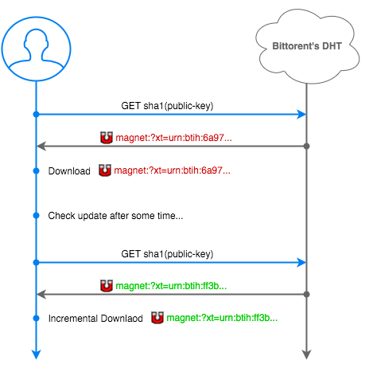

# Chunks Cli Poc

Chunks presents a decentralised way to distribute content. The content is generated by a webmaster, and spread out to the interested peers in a decentralised way via bittorrent and its DHT. And it's all nicely wrapped up with electron, so it should be smooth to use.

It's basically doing this :

### Install

 * `git clone https://github.com/pldubouilh/chunks-gui.git`
 * `npm install .` to install the deps
 * `sudo npm install -g electron-prebuilt` to download electron-prebuild
 * `electron .`

### How to use

Click on the menu, and add my test server key : `a86566ea5523bd0b088784bed1f671abfe7ff6a7c74511f0f7a15175022bedd8`

Meanwhile the dht should do its magic and connect itself up. Re-open the menu, and click on the key you just added. My test blog will be loaded and displayed. Updates will incrementally be downloaded every 5 mins.

For the servers side stuff look at [chunks-server](https://github.com/pldubouilh/chunks-server). Have a look, posting your own content should be fairly seamless !

### Security & resilience considerations

* Each node is refreshing the dht slot every 5 minutes, to keep the dht as updated as possible
* Sybil attacks. [This paper](https://www.cl.cam.ac.uk/~lw525/publications/security.pdf)
* Some kind of solution would be to poll multiple times and get some kind of vote system ?
  * Vote : [see bt-dht #79](https://github.com/feross/bittorrent-dht/issues/79)
* Multiple DHT spots (and keypair) to mitigate Sybil. Sharing same token, so possible to detect update easily.
* Investigate the possibility to use each key once, with some kind of chain so we could always be on the move.
* Update keys OTG
  * Disabling old key : Set token to INT_MAX to disable a ket >> Not playing nice with node, as this is a _very_ large number. [See this](https://github.com/themasch/node-bencode/issues/35)
  * Use a new keypair at each use so we don't sit on the same DHT spot each time. [As @substack noticed](https://gist.github.com/substack/eadd13302d785dc13aac) it's fairly easy to generate stuff close to a targeted hash.

### Further work

* Move to a chrome extension
* Keep one backup of older stuff ?
* Keys on DNS entry > See [RFC2538](https://tools.ietf.org/html/rfc2538}) ?

### Todo Gui

* Gracefully exit (destroy all the things)
* Treat spam click - Load bar to mitigate people's crazyness ?
* Rename key dblclick on label ?
* Switch to turn off all networking
* Switch to roll previous backup
* Auto connect after user clicked, but DHT wasn't connected

### Readings

* [IPFS](https://github.com/ipfs/ipfs/blob/master/papers/ipfs-cap2pfs/ipfs-p2p-file-system.pdf?raw=true)

### Deps

This project wouldn't exists without [webtorrent](https://github.com/feross/webtorrent). Many thanks to @feross and all the amazing contributors !
